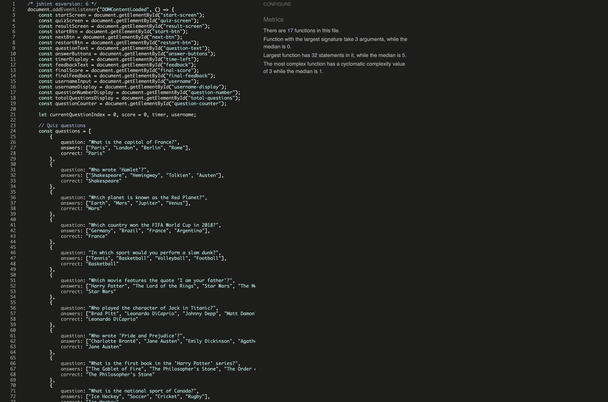

# TESTING

## Compatibility

In order to confirm the correct functionality, responsiveness and appearance:

   - The website was tested on the following browsers: Chrome and Safari.

   - Chrome 

   

   - Safari

   

## Responsiveness

- The website was checked by devtools implemented in Chrome browsers and Safari.

     - Start Page:

     

     - Questions Page:

     

     - Feedback page:

     

- The website was checked with [Website Responsive Test](https://websiteresponsivetest.com/)

  - Desktop Screens:

  
  
  

  - Tablet Screens:

  
  
  

  - Mobile Screens:

  
  
  

- The functionality of the links in the website was checked as well by different users.

## Manual Testing

| Feature                   | Action                                        | Expected Result                                       | Tested | Passed | Comments |
|---------------------------|-----------------------------------------------|------------------------------------------------------|--------|--------|----------|
| **Start Page**            | -                                             | -                                                    | -      | -      | -        |
| Username Input            | Enter a valid username and click "Start"      | Quiz begins, username is stored                      | Yes    | Yes    | -        |
| Empty Username Field      | Click "Start" without entering a username     | Error message appears                                | Yes    | Yes    | -        |
| Invalid Username          | Enter an invalid username (e.g., "123")       | Error message appears, input is cleared             | Yes    | Yes    | -        |
| **Quiz Questions**        | -                                             | -                                                    | -      | -      | -        |
| Question Display          | Start the quiz                                | A question with four answer options is visible      | Yes    | Yes    | -        |
| Answer Selection          | Click on an answer                            | The selected answer is highlighted                  | Yes    | Yes    | -        |
| Correct Answer            | Click on the correct answer                   | Score increases, next button appears                | Yes    | Yes    | -        |
| Incorrect Answer          | Click on the wrong answer                     | Score remains the same, next button appears         | Yes    | Yes    | -        |
| Timer Countdown           | Let the timer run out                         | "Time's up!" message appears                        | Yes    | Yes    | -        |
| **Feedback & Score**      | -                                             | -                                                    | -      | -      | -        |
| Quiz Completion           | Answer all questions                          | Score and feedback are displayed                    | Yes    | Yes    | -        |
| Restart Button            | Click "Restart"                               | Quiz resets to start screen                         | Yes    | Yes    | -        |
| **Navigation & UI**       | -                                             | -                                                    | -      | -      | -        |
| Mobile Responsiveness     | Open quiz on a mobile device                  | Layout adjusts properly                             | Yes    | Yes    | -        |
| Keyboard Navigation       | Use `Tab` and `Enter` keys to navigate        | Quiz can be played without a mouse                  | Yes    | Yes    | -        |
| Color Contrast            | Check quiz colors against accessibility rules | Text is readable                                    | Yes    | Yes    | -        |

---

## Validator testing
- ### HTML
   - No errors or warnings were found when passing through the official W3C validator.

   

- ### CSS
   - No errors or warnings were found when passing through the official W3C validator.  

   

- ### JS
   - No errors or warnings were found when passing through the validator.  

   

- ## LightHouse report

    - Using Lighthouse in devtools I confirmed that the website is performing well, accessible and fonts chosen are readable.

   ### Start Page

   

   ### Questions Page

   

## Bugs

- ### Solved bugs
    1. The question counter was visible on the start page.

    *Solution:* Moved #question-counter so it only appears during the quiz.

    2. The quiz rules were aligned to the left instead of being centered.

    *Solution:* Adjusted the CSS to ensure #quiz-rules-section is centered under the "QuizRush" header.

    3. The elements ("Enter your name," input box, and "Start Quiz" button) were not properly stacked.

    *Solution:* Updated the CSS to make sure these elements appear vertically aligned.

---

- ### Unsolved bugs
    - None.

---